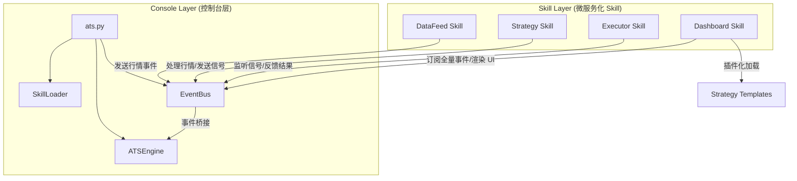

# CTA2 系统全景图 v2.0

## 1. 核心设计：模块化加载架构

CTA2 (Crypto Trading Agent 2.0) 采用 **“平台(Runner) + 技能包(Skill)”** 的插件化设计。系统核心不再硬编码具体的策略或接口，而是通过一套标准协议动态加载和组装 trading 组件。

### 1.1 技能包分类 (Skill Types)
系统将交易逻辑解构为三种标准 Skill：
- **Strategy (策略卡带)**: 执行核心数学模型与决策逻辑（如 `grid-v60`）。
- **DataFeed (数据网关)**: 负责与交易所建立通信并推送实时行情（如 `okx-feed`）。
- **Executor (指令执行)**: 负责落实买卖订单、管理仓位及对账（如 `paper-executor`）。
- **UISkill (可视化监控)**: [NEW] 负责展示系统状态与策略指标（如 `dashboard-skill`）。支持插件化加载策略专属模板。

---

## 2. 逻辑架构图

---

## 3. 核心组件交互流程

1.  **加载阶段**: `launcher.py` 调用 `SkillLoader` 扫描指定的目录，读取 `SKILL.md` 的 Frontmatter 元数据。
2.  **实例化**: `SkillLoader` 动态导入 `scripts/` 下的入口脚本，并注入 `config.json` 中的参数。
3.  **运行循环**:
    - `ATSEngine` 将 Skill 挂载至异步事件总线 `EventBus`。
    - `DataFeed` 推送 `MarketUpdate` 事件。
    - `Strategy` 监听该事件，输出 `SignalRequest`。
    - `Executor` 监听信号并反馈 `ExecutionReport`。
    - `DashboardSkill` 实时捕获上述所有事件，并动态加载策略目录下的 `dashboard/` 模板进行展示。

---

## 4. 目录规范

- `cartridges/strategies/`: 存放各种策略“卡带”。
- `cartridges/bridge/`: 存放连接外部世界的“桥接器”（DataFeeds, Executors）。
- `console/`: 存放系统的“游戏机底座”（Runner, Loader, Dashboard）。

---

> 更新日期: 2026-03-25
> 文档标准: v3.1 (Async Microservices Standard)
