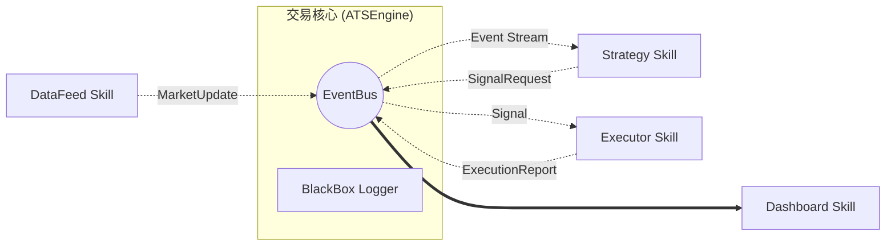

# CTS1 - ATS Microservices Architecture (Async)

基于 **异步事件驱动** 与 **Skill 微服务化** 的网格策略交易系统。

## 🏗 全新架构设计 (v3.1)

系统采用“总线制”解耦，各组件通过内部 `EventBus` 进行非阻塞通信。



### 核心特性
*   **微服务化 (Skill-based)**: 所有组件均为独立 Skill，通过 `SkillLoader` 动态加载。
*   **异步总线 (EventBus)**: 基于 `asyncio.Queue`，实现毫秒级事件流转，各组件完全解耦。
*   **黑匣子日志 (BlackBox)**: 引擎实时记录总线上所有原始事件，支持回溯分析。
*   **插件化 UI**: Dashboard 作为独立 Skill，支持自动发现并挂载策略专属的可视化模板。

## 🚀 启动指引

### 1. 运行核心引擎
```bash
python ats.py run v93_innovation --mode paper
```

### 2. 参数说明
- `run <skill_name>`: 启动指定的策略。
- `--mode [paper|live]`: 运行模式（模拟盘/实盘）。
- `--no-dashboard`: 禁用可视化看板（Headless 模式）。

## 🧩 目录结构 (新版)
*   `ats.py`: 系统统一启动入口。
*   `console/`:
    *   `runner/`: 核心引擎 `ATSEngine`、总线 `EventBus` 及 `SkillLoader`。
    *   `dashboard/`: 可视化服务器。
*   `cartridges/`:
    *   `strategies/`: 策略 Skill（如 `v93_innovation`）。
    *   `datafeeds/`: 行情 Skill（如 `okx-feed`）。
    *   `executors/`: 执行 Skill（如 `paper-executor`）。
*   `logs/trading/`: 黑匣子事件日志。

## 🚀 快速开始

### 1. 安装依赖

```bash
pip install pandas numpy flask flask-socketio requests
```

### 2. 运行回测

```bash
python main.py backtest --data btc_1m.csv --capital 10000
```

或直接使用：

```bash
python run_backtest.py --data btc_1m.csv
```

### 3. 运行模拟盘（带 Dashboard）

```bash
python main.py paper --data btc_1m.csv --port 5000
```

然后访问 http://localhost:5000

### 4. 运行 OKX 模拟盘

```bash
export OKX_API_KEY="your_key"
export OKX_SECRET="your_secret"
export OKX_PASSPHRASE="your_passphrase"

python main.py live --demo
```

## 🧩 模块说明

### 策略层 (Strategies)

策略只负责**输出信号**，不关心如何执行。

```python
from strategies import GridRSIStrategy
from core import MarketData, StrategyContext

strategy = GridRSIStrategy(symbol="BTC-USDT", grid_levels=10)

# 在回测/实盘引擎中自动调用
for data in market_feed:
    context = engine.get_context()  # 引擎提供当前账户状态
    signals = strategy.on_data(data, context)  # 策略输出信号
    for signal in signals:
        engine.execute(signal)  # 引擎执行信号
```

### 执行层 (Executors)

统一接口，支持模拟执行和真实交易无缝切换。

```python
from executors import PaperExecutor, OKXExecutor

# 模拟执行
executor = PaperExecutor(
    initial_capital=10000,
    fee_rate=0.001,
    slippage_model='adaptive'
)

# 真实执行（OKX）
executor = OKXExecutor(
    api_key="xxx",
    api_secret="xxx",
    passphrase="xxx",
    is_demo=True  # 模拟盘
)
```

### 数据层 (DataFeeds)

```python
from datafeeds import CSVDataFeed, OKXDataFeed

# CSV 历史数据
feed = CSVDataFeed(filepath="btc_1m.csv", symbol="BTC-USDT")

# OKX 实时数据
feed = OKXDataFeed(
    symbol="BTC-USDT",
    timeframe="1m",
    api_key="xxx",
    api_secret="xxx",
    passphrase="xxx"
)
```

### 引擎层 (Engines)

```python
from engines import BacktestEngine, LiveEngine

# 回测引擎
engine = BacktestEngine(
    strategy=strategy,
    executor=executor,
    initial_capital=10000
)
results = engine.run(data_feed)

# 实盘引擎
engine = LiveEngine(
    strategy=strategy,
    executor=executor,
    data_feed=feed
)
engine.run()
```

## 🧪 单元测试

```bash
python -m pytest tests/test_strategy.py -v
```

## 📊 Dashboard

启动后访问 http://localhost:5000

实时监控：
- 价格走势
- 资产曲线
- 持仓状态
- 交易记录

## 🔧 策略参数

```python
strategy = GridRSIStrategy(
    symbol="BTC-USDT",
    # 网格参数
    grid_levels=10,
    grid_refresh_period=100,
    grid_buffer_pct=0.1,
    # RSI 参数
    rsi_period=14,
    rsi_oversold=35,
    rsi_overbought=65,
    adaptive_rsi=True,
    # 仓位参数
    base_position_pct=0.1,
    max_positions=5,
    use_kelly_sizing=True,
    # 止损参数
    stop_loss_pct=0.05,
    trailing_stop=True,
)
```

## 📁 目录结构

```
cts1/
├── core/                   # 核心类型定义
│   ├── __init__.py
│   └── types.py
├── strategies/             # 策略层
│   ├── __init__.py
│   ├── base.py
│   └── grid_rsi.py
├── executors/              # 执行层
│   ├── __init__.py
│   ├── base.py
│   ├── paper.py
│   └── okx.py
├── datafeeds/              # 数据层
│   ├── __init__.py
│   ├── base.py
│   ├── csv_feed.py
│   └── okx_feed.py
├── engines/                # 引擎层
│   ├── __init__.py
│   ├── backtest.py
│   └── live.py
├── dashboard/              # 监控面板
│   ├── __init__.py
│   ├── server.py
│   └── templates/
│       └── dashboard.html
├── config/                 # 配置
│   └── okx_config.py
├── tests/                  # 测试
│   └── test_strategy.py
├── main.py                 # 统一入口
├── run_backtest.py         # 回测入口
├── run_paper.py            # 模拟盘入口
├── run_live.py             # 实盘入口
└── backup/                 # 原文件备份
```

## 🔄 与原版本的区别

| 特性 | 原版本 | 重构版 |
|-----|--------|--------|
| 策略状态 | 自维护 positions/capital | 无状态，引擎维护真相 |
| 职责分离 | 混杂 | 清晰分层 |
| 可测试性 | 难 | 易（纯函数式） |
| 多策略支持 | 难 | 是 |
| Skill 化 | 难 | 天然支持 |

## 📝 TODO

- [ ] WebSocket 数据接入优化
- [ ] 更多策略实现
- [ ] 风险管理系统
- [ ] 完整的订单生命周期管理（撤单、改单）
